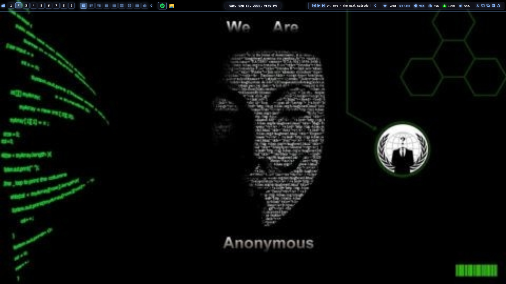
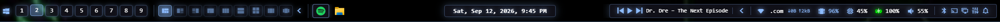

# Midnight Eclipse

A glass status bar for [Zebar](https://github.com/glzr-io/zebar), built for the [komorebi](https://github.com/LGUG2Z/komorebi) tiling window manager on Windows 11. It replaces the taskbar as the thing you look at: workspaces, layouts, your open apps, media, system readings and Quick Settings, all in one 44px strip at the top of the screen.





Pairs with the **[komorebi Midnight Eclipse preset](https://github.com/S0wet0/komorebi-midnight-eclipse)**, which is tuned for it (bar space, matching border colour, keybindings), but works with any komorebi config that reserves room for the bar.

## Features

**Left**
- **Workspace buttons**: click to switch; the focused workspace is highlighted.
- **Layout drawer**: shows the current workspace's layout; expand it to pick any of komorebi's nine layouts (BSP, columns, rows, vertical / horizontal / right-main / ultrawide stacks, grid, scrolling).
- **App list that mirrors the Windows taskbar**: the same apps, order and icons, so Windows' own **Win+1…9** shortcuts line up with the icons. Clicking an icon does exactly what the taskbar would (activate, minimize, cycle a group's windows). Grouped apps show a window count; pinned-but-closed apps are dimmed.
- **Taskbar per workspace**: the native taskbar, the app list and Win+1…9 only include windows on the workspace you're looking at.

**Middle**
- Date and time, plus the focused window's title (truncated so it never crowds the sides). Click the date for the notifications and calendar panel.

**Right**
- **Media controls**: previous / play-pause / next and the track title, which truncates first when space runs out.
- **Tray drawer**: your tray icons, collapsed behind a chevron. Left-click and right-click act as they do in the real tray.
- **Network** (opens the Wi-Fi panel), **memory**, **CPU**, **battery**, **volume** (click to mute, scroll to change, right-click for outputs) and **weather**, each with a detailed tooltip.
- **Battery that reacts instantly**: a lightning bolt through the icon while plugged in; red at 10% or below, yellow in energy saver, green while plugged in above 30%.
- **Quick Settings shortcuts**: Bluetooth, Cast, Project, the main Quick Settings panel, and notifications.

**Everywhere**
- Styled tooltips (a separate click-through widget, so they're never clipped by the bar).
- Follows the Windows light/dark theme automatically.
- If a command fails, a warning icon appears in the middle; hover it for the reason.

## Requirements

- Windows 11
- [Zebar](https://github.com/glzr-io/zebar) 3.3 or later
- [komorebi](https://github.com/LGUG2Z/komorebi) 0.1.41 or later (`winget install LGUG2Z.komorebi`)
- The .NET Framework 4 C# compiler that ships with Windows (used once, to build the two small helpers from source)
- Internet access for the bar's icon font and libraries (loaded from CDNs, as Zebar widgets usually do)

## Install

```powershell
git clone https://github.com/S0wet0/midnight-eclipse.git
cd midnight-eclipse
powershell -NoProfile -ExecutionPolicy Bypass -File .\install.ps1
```

Run it from a **normal** PowerShell (not as administrator). The installer:

1. builds the two helpers from the C# source in `helpers/` into `%LOCALAPPDATA%\midnight-eclipse\bin`;
2. copies `pack/` to `%USERPROFILE%\.glzr\zebar\midnight-eclipse`, filling in this machine's helper and `komorebic.exe` paths;
3. sets Zebar to start the bar and tooltip widgets (your `settings.json` is backed up first; use `-KeepOtherWidgets` to keep other widgets starting too), then restarts Zebar.

Re-run it to update after pulling a new version. Installing the `pack/` folder by hand, or through Zebar's marketplace, won't work: the helper paths are only filled in by the installer.

### komorebi settings the bar needs

In `komorebi.json`:

```jsonc
// Leave 44px at the top for the bar. For this setting, "right" and "bottom"
// are the width and height reduction, so a top bar needs top AND bottom.
"global_work_area_offset": { "left": 0, "top": 44, "right": 0, "bottom": 44 },

// Don't tile the bar itself.
"ignore_rules": [ { "kind": "Exe", "id": "zebar.exe", "matching_strategy": "Equals" } ]
```

The bar's accent colour is komorebi's focused-border blue, `#8DBCFF` (`border_colours` in `komorebi.json`); change both together to keep them matching. The [komorebi Midnight Eclipse preset](https://github.com/S0wet0/komorebi-midnight-eclipse) already has all three settings.

## Uninstall

```powershell
powershell -NoProfile -ExecutionPolicy Bypass -File .\uninstall.ps1
```

It puts back any windows the bar had taken off the taskbar, then removes the pack, the helpers and the startup entries.

## How it works

The bar is a single buildless Zebar widget (`pack/index.html`, React + JSX compiled in the browser) with a stylesheet of colour tokens (`pack/styles.css`), plus a second widget that draws the tooltips (`pack/tooltip.html`). Two small helper programs provide what Zebar can't:

| Helper | What it does |
|---|---|
| `taskbar-mirror` | Reads the Windows 11 taskbar's buttons through UI Automation and reports them to the bar (names, order, window counts, icons, which app is in front). Clicking an icon sends Win+N. It also takes windows on hidden komorebi workspaces off the taskbar (`ITaskbarList::DeleteTab`) and puts them back when you switch, when Zebar closes, or when komorebi stops. |
| `power-status` | Reports charger state, charge, charging and energy saver from `GetSystemPowerStatus` twice a second. Zebar's own battery provider only refreshes every 60 seconds and doesn't report energy saver. |

Both are plain C# 5, built with the compiler in Windows, and run as your normal user.

**What the bar is allowed to run.** Zebar only lets a widget start programs listed in its `zpack.json`, with arguments matching a pattern. Midnight Eclipse is limited to:
- the two helpers (`watch`, `press 0-9`);
- `explorer.exe` with Quick Settings / notification addresses;
- `komorebic` with `focus-workspace 0-8`, `change-layout <layout>`, and `query focused-workspace-index` (a 5-second check that the bar is still in sync with komorebi; if not, it resubscribes).

## Customizing

- **Colours**: the tokens at the top of `pack/styles.css` (`--accent`, `--panel-bg`, …), with a separate set for light mode.
- **Date format**: `formatting` in the `date` provider near the top of `pack/index.html`.
- **Bar height**: `height` in `pack/zpack.json`; keep komorebi's `global_work_area_offset` equal to it.

After editing files in the repo, re-run `install.ps1`.

## Known limitations

- Tested on a single monitor. The bar opens on every monitor, but the app list mirrors the main taskbar only.
- The app list reads the Windows 11 taskbar through UI Automation, which a future Windows update could change.
- Windows ignores simulated key presses from a normal program while an elevated (administrator) window is in front, so clicking an app icon may do nothing in that case.
- Minimized windows aren't on any komorebi workspace, so they stay on the taskbar wherever they came from.
- While a Quick Settings or notification flyout is open the taskbar can't be read at all; the app list keeps showing its last state until the flyout closes.

## License

[MIT](LICENSE) © 2026 S0wet0
